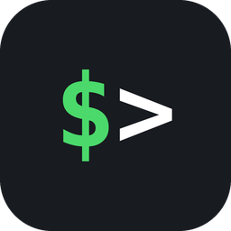

<div align="center">



### Copilot CLI for the MX Creative Keypad

[![LinkedIn][linkedin-badge]][linkedin] [![Discord][discord-badge]][discord]

Your GitHub Copilot CLI sessions, on three keys.<br>
See what is working, what is waiting on you, and jump straight to the pane.

[![CI][ci-badge]][ci] [![Release][release-badge]][release] [![License][license-badge]][license]<br>
[![Platform][platform-badge]](#requirements) [![.NET][dotnet-badge]][dotnet] [![Terminals][terminals-badge]](#how-it-works)

</div>

---

Run three or four Copilot CLI sessions at once and you get one of two failure modes: you sit
watching a session that has been busy for four minutes, or a session waits for you while you work
somewhere else and nobody notices. A keypad fixes both, because it is glanceable without stealing
focus.

| Key | Shows | Opens |
|---|---|---|
| **Active** | sessions working right now | a folder of them, longest-running first |
| **Waiting** | sessions that genuinely want you | a folder of them, blocked ones first |
| **Sessions** | every session that is open at all | a folder of all of them |

Active and Waiting are deliberately narrow, so a number on either always means something needs
doing. Everything else — open but never asked anything, or a state this build does not recognise —
appears under Sessions. Press any tile to jump to that terminal pane.

## Requirements

macOS · GitHub Copilot CLI · Logi Options+ 6.4 or newer · **Warp** or **iTerm2**

## Setup

1. Install the plugin, or build it (see [Development](#development)).
2. In Options+ the plugin appears as **Copilot CLI**. Drag **Active sessions**, **Waiting
   sessions** and **All sessions** onto three keys — all three live under its *Sessions* group.
3. Open any of them and press **Set up** twice. The second press writes
   `~/.copilot/hooks/copilot-keypad.json`.
4. Start a Copilot CLI session. A tile appears.

To disconnect, press **Set up** twice again, or delete that one file. The plugin touches nothing
else in your Copilot configuration.

## How it works

Copilot CLI loads every `*.json` under `~/.copilot/hooks/` independently, so the plugin owns
exactly one file and never edits one you or another tool wrote. That file runs `keypad-hook.sh` on
eight session events; the script records each session's state under `~/.copilot/keypad/sessions/`,
and the plugin polls it once a second.

| Hook event | Tile says | Folder |
|---|---|---|
| `sessionStart` | idle | Sessions |
| `userPromptSubmitted`, `preToolUse`, `postToolUse`, `permissionRequest` | working | Active |
| `notification` (permission prompt / elicitation) | blocked | Waiting |
| `agentStop` | ready | Waiting |
| `sessionEnd` | tile removed | — |

Sessions are keyed by whichever terminal they run in — Warp's `WARP_TERMINAL_SESSION_UUID`, or the
GUID half of iTerm2's `ITERM_SESSION_ID`. Both reduce to the same 32-hex filename, and the name is
*derived* from the identifier rather than taken from it. Warp is focused with a `warp://session`
deep link; iTerm2 by selecting the session with that id over AppleScript.

Two things that look obvious and are wrong — why `permissionRequest` does **not** mean "waiting",
and why the buttons can vanish for some applications — are in
[docs/TROUBLESHOOTING.md](docs/TROUBLESHOOTING.md), along with the debug trace.

## Known limits

- **Warp and iTerm2 only.** Terminal.app, Ghostty or a plain SSH shell export no session
  identifier, so those sessions simply get no tile.
- **iTerm2 needs an Automation permission.** Focusing goes through AppleScript, which macOS gates;
  allow Logi Plugin Service under System Settings → Privacy & Security → Automation. Warp's deep
  link needs nothing.
- **A folder key's count can lag.** `PluginDynamicFolder` has no way to invalidate its own button,
  so the plugin asks the host three different ways; leaving the folder and returning always
  redraws it.
- **Sessions already running when you press Set up** stay invisible until they next do something.

## Development

Needs .NET 10 and Logi Options+ installed.

```sh
export DOTNET_ROOT=/opt/homebrew/opt/dotnet/libexec   # Homebrew's location is non-standard
dotnet build src/CopilotCLIPlugin.csproj -c Debug     # links + reloads the plugin
./tools/package.sh                                    # -> bin/CopilotCLI_<version>.lplug4
```

```sh
dotnet test tests/CopilotCLI.Tests/CopilotCLI.Tests.csproj   # 111 tests
sh tests/hook/run-tests.sh                                   # 51 assertions
```

CI runs both on every pull request and push to `main`, plus shellcheck and a manifest check for the
rules the Marketplace enforces. **It cannot build the plugin**: `PluginApi.dll` ships inside Logi
Plugin Service, is not redistributable, and is on no hosted runner — which is why the test project
links the PluginApi-free sources instead of referencing the plugin, and why the release workflow
opens a draft for you to attach the `.lplug4` to.

`tools/preview/` renders every key to PNG without a keypad, which is how the tile design was made.

## Docs

| | |
|---|---|
| [Troubleshooting](docs/TROUBLESHOOTING.md) | wrong tile states, per-application visibility, the debug trace |
| [Publishing](docs/PUBLISHING.md) | getting a C# plugin onto the Marketplace |
| [Submission](docs/SUBMISSION.md) | this plugin's checklist and current status |
| [Design](docs/design/2026-09-25-copilotcli-design.md) | why it is built this way, with the measurements |
| [Privacy](docs/PRIVACY.md) · [EULA](docs/EULA.md) | what it reads and writes; licence terms |

## Licence

MIT — see [LICENSE](LICENSE).

<!-- badges -->
[linkedin]: https://to.messeb.com/contact
[discord]: https://discord.com/users/376434056306360320
[ci]: https://github.com/messeb/logi-copilotcli-plugin/actions/workflows/ci.yml
[release]: https://github.com/messeb/logi-copilotcli-plugin/actions/workflows/release.yml
[license]: LICENSE
[dotnet]: https://dotnet.microsoft.com/download/dotnet/10.0

[discord-badge]: https://img.shields.io/badge/Discord-messeb-5865F2?style=flat-square&logo=discord&logoColor=white
[ci-badge]: https://github.com/messeb/logi-copilotcli-plugin/actions/workflows/ci.yml/badge.svg?style=flat-square
[release-badge]: https://github.com/messeb/logi-copilotcli-plugin/actions/workflows/release.yml/badge.svg?style=flat-square
[license-badge]: https://img.shields.io/badge/license-MIT-blue?style=flat-square
[platform-badge]: https://img.shields.io/badge/platform-macOS-lightgrey?style=flat-square&logo=apple&logoColor=white
[dotnet-badge]: https://img.shields.io/badge/.NET-10.0-512BD4?style=flat-square&logo=dotnet&logoColor=white
[terminals-badge]: https://img.shields.io/badge/terminals-Warp%20%7C%20iTerm2-0A7EA4?style=flat-square

<!-- LinkedIn is not in simple-icons any more, so shields renders no icon for logo=linkedin.
     The glyph is supplied inline instead, which is why this one URL is long. -->
[linkedin-badge]: https://img.shields.io/badge/LinkedIn-messingfeld-0A66C2?style=flat-square&logo=data%3Aimage%2Fsvg%2Bxml%3Bbase64%2CPHN2ZyB4bWxucz0iaHR0cDovL3d3dy53My5vcmcvMjAwMC9zdmciIHZpZXdCb3g9IjAgMCAyNCAyNCIgZmlsbD0id2hpdGUiPjxwYXRoIGQ9Ik0yMC40NDcgMjAuNDUyaC0zLjU1NHYtNS41NjljMC0xLjMyOC0uMDI3LTMuMDM3LTEuODUyLTMuMDM3LTEuODUzIDAtMi4xMzYgMS40NDUtMi4xMzYgMi45Mzl2NS42NjdIOS4zNTFWOWgzLjQxNHYxLjU2MWguMDQ2Yy40NzctLjkgMS42MzctMS44NSAzLjM3LTEuODUgMy42MDEgMCA0LjI2NyAyLjM3IDQuMjY3IDUuNDU1djYuMjg2ek01LjMzNyA3LjQzM2MtMS4xNDQgMC0yLjA2My0uOTI2LTIuMDYzLTIuMDY1IDAtMS4xMzguOTItMi4wNjMgMi4wNjMtMi4wNjMgMS4xNCAwIDIuMDY0LjkyNSAyLjA2NCAyLjA2MyAwIDEuMTM5LS45MjUgMi4wNjUtMi4wNjQgMi4wNjV6bTEuNzgyIDEzLjAxOUgzLjU1NVY5aDMuNTY0djExLjQ1MnpNMjIuMjI1IDBIMS43NzFDLjc5MiAwIDAgLjc3NCAwIDEuNzI5djIwLjU0MkMwIDIzLjIyNy43OTIgMjQgMS43NzEgMjRoMjAuNDUxQzIzLjIgMjQgMjQgMjMuMjI3IDI0IDIyLjI3MVYxLjcyOUMyNCAuNzc0IDIzLjIgMCAyMi4yMjUgMHoiLz48L3N2Zz4%3D
